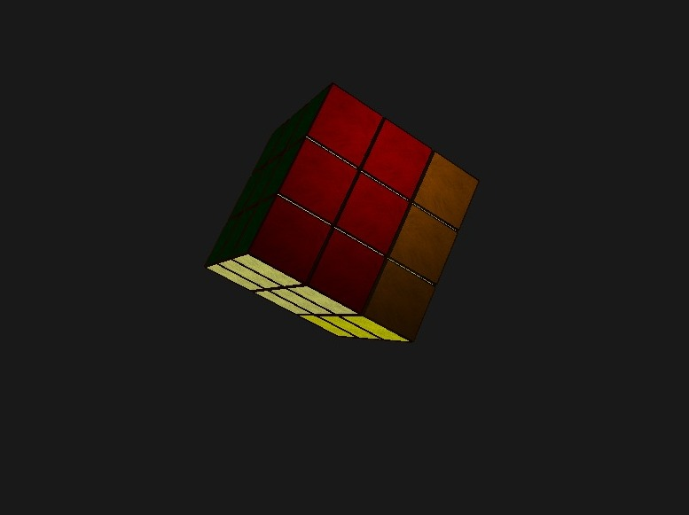

# Cubo-Rubick

---

El cubo rubik es un famoso juguete que tiene mecánicas de juego muy interesantes a nivel de programación pues se tiene algo simple como lo es un cubo pero con transformaciones en cada una de sus caras. 

Tener en cuenta que el proyecto solo tiene el proyecto con el codigo e imagenes y las librerias. No tiene las dependencias necesarias como glfw o glad. 

---

# Instrucciones

Para mover el cubo se usan los numeros del 1 al 9.

Para mover los inversos de las camadas se usa del "q" al "o".

Para mover la posición de la camara se usan z,s,x,c.

Para mover la camara para la animación se usa b.

Para quitar la animación de la cámara se usa v.

Para hacer explotar el cubo se usa h.

Para volver a armarlo se usa tambien la h.

Para desordenar el cubo se usa la j.

Para solucionar el cubo se usa la m.

---

# Referencia

NVIDIA. OpenGL, learn opengl. https://learnopengl.com/About. 2023.
